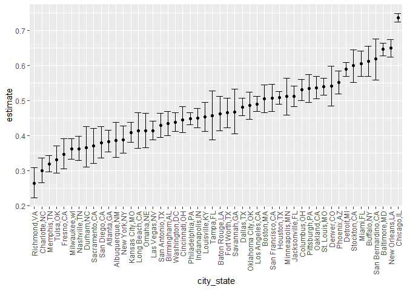
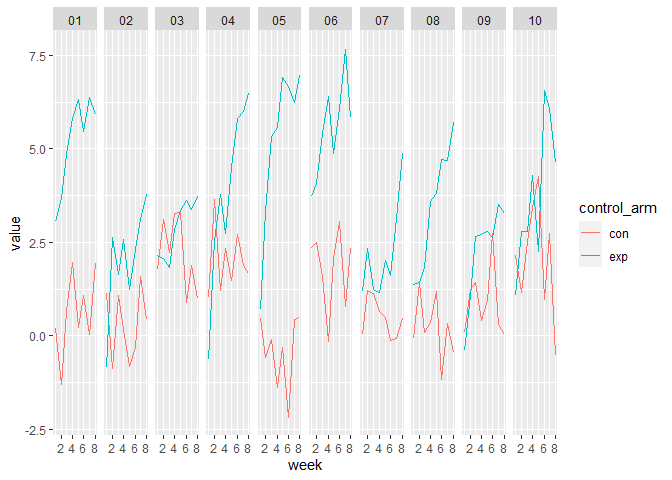

p8105\_hw5\_yk2960
================
Youyuan(Keviant) Kong
2021/11/18

## Problem 1

For this problem, we are interested in data gathered and made public by
*The Washington Post* in homicides in 50 large U.S. cities. The code
chunk below imports and clean the data.

``` r
homicides_df<-read_csv("data-homicides-master/homicide-data.csv",
                       na=c("","Unknown")) %>% 
  janitor::clean_names()
```

    ## Rows: 52179 Columns: 12

    ## -- Column specification --------------------------------------------------------
    ## Delimiter: ","
    ## chr (8): uid, victim_last, victim_first, victim_race, victim_sex, city, stat...
    ## dbl (4): reported_date, victim_age, lat, lon

    ## 
    ## i Use `spec()` to retrieve the full column specification for this data.
    ## i Specify the column types or set `show_col_types = FALSE` to quiet this message.

    ## Warning in FUN(X[[i]], ...): strings not representable in native encoding will
    ## be translated to UTF-8

    ## Warning in FUN(X[[i]], ...): unable to translate '<U+00C4>' to native encoding

    ## Warning in FUN(X[[i]], ...): unable to translate '<U+00D6>' to native encoding

    ## Warning in FUN(X[[i]], ...): unable to translate '<U+00E4>' to native encoding

    ## Warning in FUN(X[[i]], ...): unable to translate '<U+00F6>' to native encoding

    ## Warning in FUN(X[[i]], ...): unable to translate '<U+00DF>' to native encoding

    ## Warning in FUN(X[[i]], ...): unable to translate '<U+00C6>' to native encoding

    ## Warning in FUN(X[[i]], ...): unable to translate '<U+00E6>' to native encoding

    ## Warning in FUN(X[[i]], ...): unable to translate '<U+00D8>' to native encoding

    ## Warning in FUN(X[[i]], ...): unable to translate '<U+00F8>' to native encoding

    ## Warning in FUN(X[[i]], ...): unable to translate '<U+00C5>' to native encoding

    ## Warning in FUN(X[[i]], ...): unable to translate '<U+00E5>' to native encoding

The dataset’s size is 12 columns× 52179 rows. </br> It has 12 variables,
which are:</br> uid, reported\_date, victim\_last, victim\_first,
victim\_race, victim\_age, victim\_sex, city, state, lat, lon,
disposition </br> In these variables, </br> UID：Unique
Indentification</br> reported\_date: reported date, include day, month,
year, e.g “20040503”</br> victim\_last: first be slamed

``` r
homicides_df<-
  homicides_df %>% 
  mutate(
    city_state=str_c(city,",",state),
    resolution=case_when(
      disposition=="Closed without arrest" ~"unsolved",
      disposition=="Closed by arrest" ~"solved",
      disposition=="Open/No arrest" ~"unsolved"
    )) %>% 
  relocate(city_state) %>% 
  filter(city_state!="Tulsa,AL")
```

``` r
baltimore_df<-
  homicides_df %>% 
  filter(city_state=="Baltimore,MD")
baltimore_summary<-
  baltimore_df %>% 
    summarize(
      unsolved=sum(resolution=="unsolved"),
      n=n()
    )

baltimore_test<-
  prop.test(
    x=baltimore_summary %>% pull(unsolved),
    n=baltimore_summary %>% pull(n)
  )

baltimore_test %>% 
  broom::tidy()
```

    ## # A tibble: 1 x 8
    ##   estimate statistic  p.value parameter conf.low conf.high method    alternative
    ##      <dbl>     <dbl>    <dbl>     <int>    <dbl>     <dbl> <chr>     <chr>      
    ## 1    0.646      239. 6.46e-54         1    0.628     0.663 1-sample~ two.sided

``` r
prop_test_function<-function(city_df){
  city_summary<-
  city_df %>% 
    summarize(
      unsolved=sum(resolution=="unsolved"),
      n=n()
    )
  city_test<-
  prop.test(
    x=city_summary %>% pull(unsolved),
    n=city_summary %>% pull(n)
  )
  return(city_test)
}


result_df<-
  homicides_df %>% 
    nest(data=uid:resolution) %>% 
    mutate(
      test_results=map(data,prop_test_function),
      tidy_results=map(test_results,broom::tidy)
    ) %>% 
  select(city_state,tidy_results) %>% 
  unnest(tidy_results) %>% 
  select(city_state,estimate,starts_with("conf"))
```

``` r
result_df %>% 
  mutate(city_state=fct_reorder(city_state,estimate)) %>% 
  ggplot(aes(x=city_state,y=estimate))+
  geom_point()+
  geom_errorbar(aes(ymin=conf.low,ymax=conf.high))+
  theme(axis.text.x=element_text(angle=90,vjust=0.5,hjust=1))
```

<!-- -->

## Problem 2

Start with a dataframe containing all file names.

``` r
file_list<-("data/") %>% 
  paste(list.files("data"),sep="") 
```

Iterate over file names and read in data for each subject using </br>
and saving the result as a new variable in the dataframe.

``` r
study<-purrr::map_dfr(file_list,read.csv) 
```

Tidy the result; manipulate file names to include control arm and
subject ID.

``` r
study<-study %>% 
  mutate(control_arm=file_list) %>% 
  mutate(subject_ID=substr(control_arm,10,11)) %>% 
  mutate(control_arm=substr(control_arm,6,8)) %>% 
  relocate(subject_ID,control_arm) %>% 
  janitor::clean_names() %>% 
  pivot_longer(
    week_1:week_8,
    names_to="week",
    names_prefix="week_",
    values_to="value"
  ) %>% 
  mutate(week=as.numeric(week))
```

Make a spaghetti plot showing observations on each subject over time

``` r
ggplot(data=study, aes(x=week,y=value,color=control_arm))+
  geom_line()+
  facet_grid(.~subject_id)
```

<!-- -->

#### For most of the subjects, the control arm is usually smaller than experimental

arm.

## Problem 3

``` r
set.seed(10)

iris_with_missing = iris %>% 
  map_df(~replace(.x, sample(1:150, 20), NA)) %>%
  mutate(Species = as.character(Species))

makeup<-function(x){
  if(is.character(x)){
     x<-replace(x,is.na(x),"virginica")
  }
  if(is.numeric(x)){
 
      x<-replace(x,is.na(x),mean(x,na.rm=TRUE))
  }
  x
}

a<-c(1,2,3,NA)

iris_makingup<-map(iris_with_missing,makeup) %>% 
  data.frame()
```
